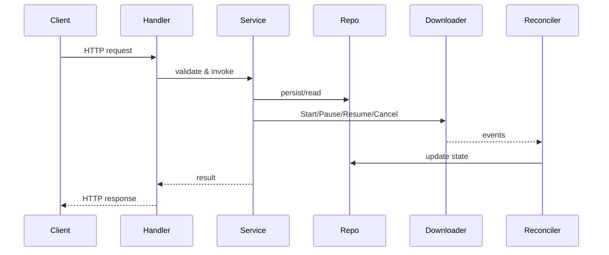

# Architecture

Torrus is composed of small layers wired through tiny interfaces.
The typical request travels through the following components:

The event flow is asynchronous: downloaders report status changes via
`Event` messages that the reconciler applies to the repository.

## Responsibilities

### API (v1 handlers)
- HTTP routing and JSON marshaling.
- Authentication, logging and basic validation via middleware.

### Middleware
- Authentication checks.
- Request/response logging.

### Service
- Orchestrates repository access and downloader actions.
- Enforces business rules and idempotency.

### Repo
- Interfaces: `DownloadReader`, `DownloadWriter`, `DownloadFinder`.
- In-memory implementation for development.
- Uses an `Update` mutation closure to ensure atomic updates.

### Downloader(s)
- Interface with `Start`, `Pause`, `Resume`, `Cancel`, `Purge`.
- Noop and aria2 adapters provided.
- Optional `EventSource` emits events through a `Reporter`.

### Reconciler
- Consumes downloader events.
- Applies status changes, GID swaps, and metadata updates.

### aria2 Adapter
- Translates downloader calls into aria2 JSON‑RPC requests.
- Polls aria2 for progress and meta events.

### Events / Reporter
- `Reporter` publishes events, typically over a channel.
- Events include progress, metadata, lifecycle transitions and GID updates.

## Versioning

All API routes are versioned under `/v1`. New breaking changes will
appear under a new prefix. The health check endpoint `/healthz` remains
unversioned so infrastructure probes do not need to track API versions.
